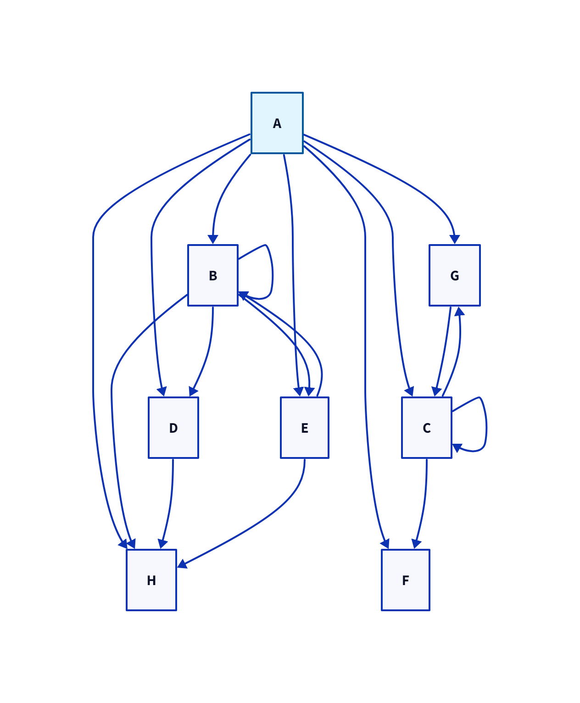

# Инструмент визуализации графа зависимостей (Вариант 17)

## Описание проекта
CLI-приложение для анализа и визуализации зависимостей пакетов Ubuntu (apt). Проект реализован в соответствии с требованиями варианта 17 задания по конфигурационному управлению.

## 1 этап
## Функциональность
```bash
Цель: создать минимальное CLI-приложение и сделать его настраиваемым. 
```

### Реализованные команды
- **`--config`** - реализация вывода конфигурационного файла


### Особенности реализации
- **Конфигурационный файл формата CSV** - источник настраиваемых пользователем параметров
- **Настраиваемые параметры** в формате (имя анализируемого пакета, URL-адрес репозитория или путь к файлу тестового репозитория, режим работы с тестовым репозиторием, режим вывода зависимостей в формате ASCII-дерева, подстрока для фильтрации пакетов)
- **Формате ключ-значение** -  При запуске приложения вывести все параметры настраиваемые пользователем, в формате ключ-значение (только для этого этапа)
- **Обработка ошибок** для неизвестных команд

### Клонирование репозитория
```bash
git clone https://github.com/TheOldBandaid/package-manager
cd package-manager
```

#### Вызов 
```bash
python main.py --config main.csv
```

#### Обработка ошибок
```bash
python main.py --config error.csv 
Загрузка конфигурации...
Ошибка: Конфигурационный файл не найден: error.csv
```

#### Наполнение csv файла
```bash
package;nginx
repository;https://repo.ubuntu.com
test_mode;true
ascii_tree;false
filter_substring;dev
```

#### Вывод программы
```bash
package: nginx
repository: https://repo.ubuntu.com
test_mode: True
ascii_tree: False
filter_substring: dev
```

## 2 этап
## Функциональность
```bash
Цель: реализовать основную логику получения данных о зависимостях для их дальнейшего анализа и визуализации. 
```

### Реализованные команды
- **`--stage 2`** - реализация основной цели этапа 2
- **`--stage 1`** - этап 1

### Особенности реализации
- **test_file: test.txt** - добавление нового параметра в csv файл
- **test.txt** - прямые зависимости заданые текстовым документом

### Запуск работы этапа 2:
```bash
python main.py --config call.csv --stage 2
```

#### Вывод на примере текстового документа
```bash
python main.py --config call.csv --stage 2
Загрузка конфигурации...
Загрузка конфигурации...
Текущая конфигурация:
----------------------------------------
package: nginx
repository: http://archive.ubuntu.com/ubuntu
test_mode: True
ascii_tree: False
filter_substring: dev
test_file: test.txt
----------------------------------------
Конфигурация успешно загружена и валидирована!

Сбор данных для пакета: nginx
Режим тестирования: включен
Используется тестовый режим

Прямые зависимости пакета 'nginx':
----------------------------------------
1. libc6
2. libpcre3
3. libssl3
4. zlib1g
5. nginx-common
6. nginx-core
----------------------------------------
Данные о зависимостях успешно собраны!
```


#### Несуществующий пакет
```bash
python main.py --config call.csv --stage 2
Загрузка конфигурации...
Загрузка конфигурации...
Текущая конфигурация:
----------------------------------------
package: ngi
repository: http://archive.ubuntu.com/ubuntu
test_mode: True
ascii_tree: False
filter_substring: dev
test_file: test.txt
----------------------------------------
Конфигурация успешно загружена и валидирована!

Сбор данных для пакета: ngi
Режим тестирования: включен
Используется тестовый режим

Прямые зависимости пакета 'ngi':
----------------------------------------
Зависимости не найдены
----------------------------------------
Данные о зависимостях успешно собраны!
```


## 3 этап
## Функциональность
```bash
Цель: построить граф зависимостей (с учетом транзитивности) и выполнить основные операции над ним. 
```

### Реализованные команды
- **`--stage 3`** - реализация основной цели этапа 3

### Особенности реализации
- **test_phase3.txt** - цилкические зависимости заданые текстовым документом
- **call2.csv** - добавление нового пакета

### Запуск работы этапа 3:
```bash
python main.py --config call2.csv --stage 3
```

#### Вывод на примере текстового документа
```bash
--config call2.csv --stage 3
Загрузка конфигурации...
Предупреждение: строка 1 пропущена - неверный формат: [file name]: config_stage3.csv
Предупреждение: строка 2 пропущена - неверный формат: [file content begin]
Предупреждение: строка 9 пропущена - неверный формат: [file content end]
Загрузка конфигурации...
Текущая конфигурация:
----------------------------------------
package: A
repository: test_repo
test_mode: True
ascii_tree: True
filter_substring: X
test_file: test_phase3.txt
----------------------------------------
Конфигурация успешно загружена и валидирована!

Сбор данных для пакета: A
Режим тестирования: включен
Используется тестовый режим

Прямые зависимости пакета 'A':
----------------------------------------
1. B
2. C
----------------------------------------
Данные о зависимостях успешно собраны!

Построение полного графа зависимостей...
Пакет: A
Фильтрация по подстроке: 'X'

Полный граф зависимостей пакета 'A':
--------------------------------------------------
A
├── │   B
│   ├── │   │   └── B (цикл)
│   ├── │   │   D
│   │   └── │   │       H
│   ├── │   │   E
│   │   ├── │   │   │   └── B (цикл)
│   │   └── │   │       H
│   └── │       H
├── │   C
│   ├── │   │   └── C (цикл)
│   ├── │   │   F
│   └── │       G
│       └── │           └── C (цикл)
├── │   D
│   └── │       H
├── │   E
│   ├── │   │   B
│   │   ├── │   │   │   └── B (цикл)
│   │   ├── │   │   │   D
│   │   │   └── │   │   │       H
│   │   ├── │   │   │   └── E (цикл)
│   │   └── │   │       H
│   └── │       H
├── │   F
├── │   G
│   └── │       C
│       ├── │       │   └── C (цикл)
│       ├── │       │   F
│       └── │           └── G (цикл)
└──     H
--------------------------------------------------

Статистика графа:
Всего пакетов в графе: 8

Сбор данных для пакета: A
Режим тестирования: включен
Используется тестовый режим
Прямые зависимости: 2
Транзитивные зависимости: 7
Граф зависимостей успешно построен!
```

## 4 этап
## Функциональность
```bash
Цель: выполнить дополнительные операции над графом зависимостей. 
```

### Реализованные команды
- **`--stage 4`** - реализация основной цели этапа 4

### Запуск работы этапа 4:
```bash
python main.py --config call2.csv --stage 4
```

#### Вывод на примере текстового документа изначально
```bash
python main.py --config call2.csv --stage 4
Загрузка конфигурации...
Предупреждение: строка 1 пропущена - неверный формат: [file name]: config_stage3.csv
Предупреждение: строка 2 пропущена - неверный формат: [file content begin]
Предупреждение: строка 9 пропущена - неверный формат: [file content end]
Загрузка конфигурации...
Текущая конфигурация:
----------------------------------------
package: A
repository: test_repo
test_mode: True
ascii_tree: True
filter_substring: X
test_file: test_phase3.txt
----------------------------------------
Конфигурация успешно загружена и валидирована!

Сбор данных для пакета: A
Режим тестирования: включен
Используется тестовый режим

Прямые зависимости пакета 'A':
----------------------------------------
1. B
2. C
----------------------------------------
Данные о зависимостях успешно собраны!

Построение полного графа зависимостей...
Пакет: A
Фильтрация по подстроке: 'X'

Полный граф зависимостей пакета 'A':
--------------------------------------------------
A
├── │   B
│   ├── │   │   └── B (цикл)
│   ├── │   │   D
│   │   └── │   │       H
│   ├── │   │   E
│   │   ├── │   │   │   └── B (цикл)
│   │   └── │   │       H
│   └── │       H
├── │   C
│   ├── │   │   └── C (цикл)
│   ├── │   │   F
│   └── │       G
│       └── │           └── C (цикл)
├── │   D
│   └── │       H
├── │   E
│   ├── │   │   B
│   │   ├── │   │   │   └── B (цикл)
│   │   ├── │   │   │   D
│   │   │   └── │   │   │       H
│   │   ├── │   │   │   └── E (цикл)
│   │   └── │   │       H
│   └── │       H
├── │   F
├── │   G
│   └── │       C
│       ├── │       │   └── C (цикл)
│       ├── │       │   F
│       └── │           └── G (цикл)
└──     H
--------------------------------------------------

Статистика графа:
Всего пакетов в графе: 8

Сбор данных для пакета: A
Режим тестирования: включен
Используется тестовый режим
Прямые зависимости: 2
Транзитивные зависимости: 7
Граф зависимостей успешно построен!

Этап 4: Поиск обратных зависимостей
Введите имя пакета для поиска обратных зависимостей: B
```

#### Вывод на примере текстового документа после ввода параметра
```bash
Введите имя пакета для поиска обратных зависимостей: B

Обратные зависимости пакета 'B':
--------------------------------------------------
1. A
2. E
--------------------------------------------------
Поиск обратных зависимостей завершен
```
```
Введите имя пакета для поиска обратных зависимостей: A      

Обратные зависимости пакета 'A':
--------------------------------------------------
Обратные зависимости не найдены
--------------------------------------------------
Поиск обратных зависимостей завершен!
```
```
Введите имя пакета для поиска обратных зависимостей: G

Обратные зависимости пакета 'G':
--------------------------------------------------
1. C
--------------------------------------------------
Поиск обратных зависимостей завершен!
```

## 5 этап
## Функциональность
```bash
Цель: получить графическое представление графа зависимостей. 
```

### Реализованные команды
- **`--stage 5`** - реализация основной цели этапа 5

### Особенности реализации
- **Язык диаграмм D2** - формирование текстового представления графа зависимостей
- **Вывод описания графа** - отображение D2 кода на экране
- **ASCII-дерево** - дополнительный вывод при соответствующем параметре
- **Демонстрация для трех пакетов** - формирование текстового представления графа зависимостей
- **Автоматический рендеринг** - формирование текстового представления графа зависимостей

### Запуск работы этапа 5:
```bash
python main.py --config call2.csv --stage 4
```

#### Вывод на примере текстового документа
**предыдущий вывод остальных 4 этапов**
```bash
4. Демонстрация визуализации для различных пакетов...

Демонстрация для различных пакетов:
1. Пакет 'A': 7 зависимостей
   D2 описание сохранено в: demo_A.d2
Диаграмма сохранена как: demo_A.png
   Диаграмма отрендерена: demo_A.png
2. Пакет 'B': 4 зависимостей
   D2 описание сохранено в: demo_B.d2
Диаграмма сохранена как: demo_B.png
   Диаграмма отрендерена: demo_B.png
3. Пакет 'C': 3 зависимостей
   D2 описание сохранено в: demo_C.d2
Диаграмма сохранена как: demo_C.png
   Диаграмма отрендерена: demo_C.png
----------------------------------------
5. Сохранение D2 диаграммы...
D2 описание сохранено в файл: dependency_graph.d2
6. Попытка рендеринга диаграммы...
Диаграмма сохранена как: dependency_graph.png
✓ Диаграмма успешно отрендерена: dependency_graph.png
```

#### Описание d2 файла на примере dependency_graph
```bash
# Граф зависимостей пакетов

A: {
  style: {
    fill: "#e1f5fe"
    stroke: "#01579b"
  }
}
B
C
D
E
F
G
H

A -> B
A -> H
A -> E
A -> G
A -> D
A -> C
A -> F
B -> H
B -> B
B -> D
B -> E
D -> H
E -> H
E -> B
C -> G
C -> C
C -> F
G -> C
```

#### Визуализация графов на примере dependency_graph



## PS: Прошу оцените также работу "Эмулятор командной оболочки UNIX" представленной по ссылке (раньше был приватный режим)
```bash
https://github.com/TheOldBandaid/consol
```